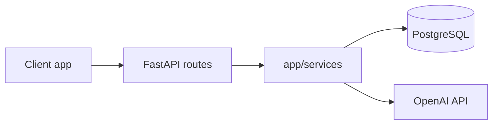

# Understanding this codebase (beginner-friendly)

This guide helps you **see the big picture first**, then **drill into files** when you need to change something. You do not need to know every framework detail on day one.

**Other docs:** [README.md](README.md) (setup and run), [API.md](API.md) (exact JSON for frontends).

---

## Start here: what happens when someone chats?

1. A **client** (browser, mobile app, or `curl`) sends HTTP **JSON** to this server.
2. **FastAPI** (the web framework) receives the request and runs a **route** (a Python function tied to a URL).
3. The route may **save** the user’s message to **PostgreSQL**, **check** if the question is on-topic, **call OpenAI** for an answer, then **save** the reply and send JSON back.

That is the whole loop: **HTTP in → Python logic → database / OpenAI → HTTP out**.



---

## Words you will see in the code

| Term | Plain meaning |
|------|----------------|
| **Route / endpoint** | A URL + HTTP method (e.g. `POST /chat/`) handled by one function. |
| **Request body** | JSON the client sends; Python checks it with **Pydantic** models in `app/models/schemas.py`. |
| **LLM** | Large language model; here, OpenAI’s chat API. |
| **Session (database)** | A short-lived connection that lets you read/write rows; created by `get_db` in `app/db/session.py`. |
| **ORM** | “Object–relational mapping”: Python classes in `app/db/models.py` that match SQL tables. |
| **Migration** | A versioned script that updates the database shape (tables/columns). Stored under `alembic/versions/`. |
| **Dependency injection** | FastAPI calls `get_db` for you and passes a DB session into the route—no global database in routes. |

---

## What this app does (checklist)

- **Chat API** for a **pharma-themed** assistant (OpenAI).
- **Optional guard:** if `GUARD_ENABLED` is true, a small classifier decides “pharma-related or not”; off-topic questions get a fixed message without the main model.
- **Storage:** users (signup/login), conversations, and messages in **PostgreSQL**.
- **Streaming:** `/chat/stream` sends the reply as **SSE** (chunks over time) instead of one big JSON response.

---

## Three layers (how to think while reading code)

Imagine a restaurant:

| Layer | Role | Think of it as… | Main folders |
|-------|------|-----------------|--------------|
| **HTTP** | URLs, status codes, JSON in/out | Front desk: takes orders, returns plates | `main.py`, `app/routes/`, `app/models/schemas.py` |
| **Use cases** | Rules + OpenAI + “save message” | Kitchen: actually prepares the answer | `app/services/` |
| **Infrastructure** | Database, config, migrations | Pantry + wiring: where data lives | `app/db/`, `alembic/`, `app/config.py` |

If a file feels confusing, ask: is this **defining the API**, **doing the work**, or **talking to the database/config**?

---

## Folder and file map

```
genric/
  main.py                 # Creates the app, CORS, runs migrations on startup, mounts /chat and /user routes
  instruction.md          # This guide
  README.md               # How to install and run
  API.md                  # Endpoint details for frontend developers
  .env                    # Secrets (not in git); copy from .env.example
  requirements.txt        # Python packages

  app/
    config.py             # Reads .env into one settings object (API key, DB URL, models, guard on/off)
    routes/
      chat.py             # /chat, /chat/stream, /chat/load-conversation, /chat/recent-conversations
      user.py             # /user/signup, /user/login
    models/
      schemas.py          # Shape of JSON for requests/responses (not the database tables)
    services/
      llm.py              # Calls OpenAI (normal reply + streaming)
      intent_classifier.py# “Is this pharma-related?” gate
      conversation_store.py # Create conversation, append messages, list history
    prompts/
      __init__.py         # Text templates (e.g. rejection message)
    db/
      base.py             # SQLAlchemy base class for ORM models
      models.py           # Tables: User, Conversation, Message
      session.py          # Engine, sessions, get_db for FastAPI
      database_url.py     # Makes sure PostgreSQL URLs use the psycopg3 driver

  alembic/
    env.py                # How Alembic finds your DB and models
    versions/             # One file per schema change
  alembic.ini             # Alembic settings
```

---

## Step by step: `POST /chat/` (one full reply)

Read this alongside `app/routes/chat.py` (function `chat`).

1. FastAPI reads the JSON body and builds a **`ChatRequest`** (`app/models/schemas.py`).
2. The route gets a database **`Session`** via **`get_db`**.
3. **`ensure_conversation`** makes sure the conversation row exists (and links optional `user_id`).
4. **`add_message`** stores the **user** message.
5. If **`GUARD_ENABLED`** and **`classify_query`** says “off-topic”: store an **assistant** message with the rejection text, return it. **Done** (OpenAI main model is not called).
6. Otherwise **`get_chat_response`** (`llm.py`) calls OpenAI, then the assistant reply is saved and returned as **`ChatResponse`**.
7. On success, **`get_db`** **commits** the transaction; on error it **rolls back**.

So: **validate → save user text → maybe block → maybe OpenAI → save assistant text → respond**.

---

## Step by step: `POST /chat/stream`

Same idea as `/chat/`, with two important differences:

- **Rejected (guard):** the stream returns a short SSE event; **no** database writes on that path (unlike non-streaming chat, which stores the rejection as a message).
- **Allowed:** the **user** message is written and **committed** in one short DB session **before** streaming starts, so the server does not hold a DB connection open for the whole stream. When streaming **finishes**, a **new** session saves the full assistant text.

If you are debugging “missing assistant message after stream,” check that the stream completed and that the final-save path ran.

---

## Step by step: `POST /chat/load-conversation`

- Input: **`LoadConversationRequest`** (a `conversation_id`).
- Output: **`ConversationHistoryResponse`**: messages in order (user/assistant, text, timestamps).

Use this to rebuild the UI when the user opens an old thread.

---

## Step by step: `POST /chat/recent-conversations`

- Query parameter: **`user_id`** (UUID).
- Returns recent conversations for that user (see `RecentConversationsResponse` in `schemas.py`).

Handy for a “your chats” sidebar after login.

---

## Step by step: signup and login (`/user/...`)

File: **`app/routes/user.py`**.

**Signup (`POST /user/signup`):**

1. Check if the email already exists → if yes, **409**.
2. Create a **`User`** with **`hash_password`** (never store plain passwords).
3. Commit and return **`user_id`**.

**Login (`POST /user/login`):**

1. Find user by email; verify password with **`verify_password_hash`**.
2. Wrong email or password → **401** (same message for both, so attackers cannot tell which failed).
3. Return **`user_id`** for the client to send on chat requests.

---

## Database and migrations (short version)

- **`app/db/models.py`** defines **tables** as Python classes.
- **`alembic/versions/*.py`** files are **instructions** to change the real PostgreSQL database over time.
- When you run the app, **`main.py`** runs **`alembic upgrade head`** so the DB always matches the latest migration (if there is nothing new, it does nothing).

**When you change a table** (add a column, new table):

1. Edit **`app/db/models.py`**.
2. Generate a migration: `alembic revision --autogenerate -m "describe change"`.
3. **Open the new file** under `alembic/versions/` and verify it looks right (autogenerate is not perfect).
4. Commit the migration file; next app start applies it.

**`DATABASE_URL`** lives in **`.env`**. Bare `postgresql://` URLs are adjusted to use **psycopg v3** in **`database_url.py`**.

---

## Configuration (`.env`)

| Variable | Purpose |
|----------|---------|
| `OPENAI_API_KEY` | Required; talks to OpenAI |
| `DATABASE_URL` | Required; PostgreSQL connection string |
| `MODEL_NAME` | Main chat model (default `gpt-4o-mini`) |
| `CLASSIFIER_MODEL_NAME` | Model for the guard (default `gpt-4o-mini`) |
| `GUARD_ENABLED` | `true` = run classifier before main LLM |

Template: **`.env.example`**.

---

## Two different “models” (a common beginner snag)

| File | Meaning |
|------|---------|
| **`app/models/schemas.py`** | **API contract:** what JSON looks like over the wire (request/response). |
| **`app/db/models.py`** | **Database layout:** rows and columns in PostgreSQL. |

They may look similar but are **not** the same thing. The API layer should stay stable; the database can evolve with migrations without exposing every column to clients.

**Analogy:** the **schema** is the menu a customer sees; the **ORM model** is how ingredients are stored in the back.

---

## How to run locally (reminder)

1. `pip install -r requirements.txt`
2. Copy **`.env.example`** → **`.env`** and set **`OPENAI_API_KEY`** and **`DATABASE_URL`**
3. PostgreSQL running, database created
4. `python main.py` or `uvicorn main:app --reload`

Try **http://127.0.0.1:8000/docs** to call endpoints interactively.

---

## “I want to change X — where do I go?”

| Goal | Start here |
|------|------------|
| New URL or change an existing route | `app/routes/chat.py` or `user.py`; register new routers in `main.py` |
| Change request/response JSON | `app/models/schemas.py` |
| Change system style or rejection wording | `app/prompts/__init__.py` |
| Change how OpenAI is called (model, parameters) | `app/services/llm.py` |
| Make the guard stricter or looser | `app/services/intent_classifier.py` |
| Change how chats are saved or listed | `app/services/conversation_store.py` |
| Add/change database tables | `app/db/models.py` + new Alembic revision |
| Connection pooling or session behavior | `app/db/session.py`, `app/db/database_url.py` |
| Rename env vars or defaults | `app/config.py` |
| Alembic can’t find models / wrong DB URL | `alembic/env.py` |

---

## Suggested reading order (first week)

1. **`main.py`** — startup, health check, which routers exist  
2. **`app/routes/chat.py`** — the core user-facing behavior  
3. **`app/models/schemas.py`** — what each endpoint accepts and returns  
4. **`app/services/conversation_store.py`** + **`app/db/models.py`** — how chat is stored  
5. **`app/services/llm.py`** and **`intent_classifier.py`** — OpenAI and the guard  
6. **One file** in **`alembic/versions/`** — what a migration looks like  

Then skim **`app/routes/user.py`** if you care about accounts.

---

## Health check

**`GET /health`** runs a cheap **`SELECT 1`** against the database. Use it to confirm the API process and PostgreSQL can talk to each other (see `main.py`).
